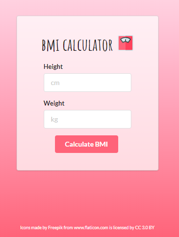
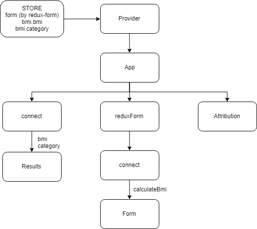

## BMI calculator

Practicing how to handle forms with Redux Form library. 
This is an app which calculates person's body mass index. BMI is a measure of body fat based on height and weight.

#### App

#### App structure

#### Stack

-   React
-   Redux
-   React-Redux
-   Redux-Form
-   Semantic UI
-   Redux DevTools extension
